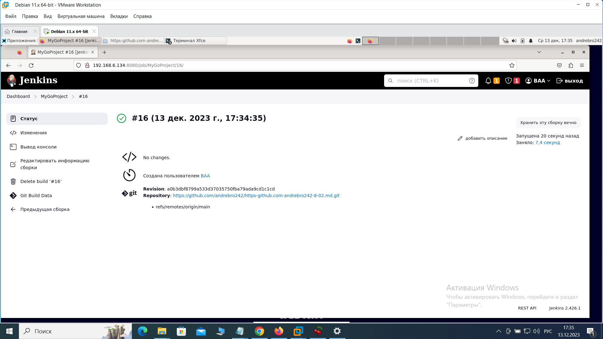

«Что такое DevOps. СI/СD» Брюхов А SYS-26

Задание 1
Что нужно сделать:

Установите себе jenkins по инструкции из лекции или любым другим способом из официальной документации. Использовать Docker в этом задании нежелательно.
Установите на машину с jenkins golang.
Используя свой аккаунт на GitHub, сделайте себе форк репозитория. В этом же репозитории находится дополнительный материал для выполнения ДЗ.
Создайте в jenkins Freestyle Project, подключите получившийся репозиторий к нему и произведите запуск тестов и сборку проекта go test . и docker build ..
В качестве ответа пришлите скриншоты с настройками проекта и результатами выполнения сборки.

Решение 1
Установка Jenkins
1. Обновил пакеты системы:
sudo apt update

2.Установил Java Development Kit (JDK). Jenkins требует Java для работы:
sudo apt install openjdk-11-jdk

3.Добавил репозиторий Jenkins и установил его:
wget -q -O - https://pkg.jenkins.io/debian/jenkins.io.key | sudo apt-key add -
sudo sh -c 'echo deb http://pkg.jenkins.io/debian-stable binary/ > /etc/apt/sources.list.d/jenkins.list'
sudo apt update 
sudo apt install jenkins

4.Запустил службу Jenkins:
sudo systemctl start jenkins

5.Включил автозапуск Jenkins при старте системы:
sudo systemctl enable jenkins

6.Проверил статус Jenkins:
sudo systemctl status jenkins

7.Открыл веб-браузер по адресу http://192.168.6.134:8080. Первоначальный пароль в /var/lib/jenkins/secrets/initialAdminPassword на сервере.

Установка  golang
1. Загрузил архив с https://go.dev/doc/install
2. Извлек загруженный архив в /usr/local:
sudo rm -rf /usr/local/go && sudo tar -C /usr/local -xzf /home/andrebro242/Загрузки/go1.21.5.linux-amd64.tar.gz
3. Добавил /usr/local/go/bin в переменную среды PATH (файл ~/.profile ).Если установка системная то sudo nano /etc/profile:
nano ~/.profile
export PATH=$PATH:/usr/local/go/bin
4.Активирую измененную переменную PATH:
source ~/.profile
5.Проверяю корректность установки:
go version

6.Создание Freestyle Project:https://localhost:8080

  1.создал New Item и дал название "MyGoProject"
  2.настройки проекта: 
Выбор ветки и настройка исходного кода (Source Code Management):
        В разделе "Управление исходным кодом" выбрал "Git".
        Указал URL форка репозитория на GitHub.

Триггеры сборки (Build Triggers):
В разделе "Триггеры сборки" выбрал "GitHub hook trigger for GITScm polling". Это позволит Jenkins запускать сборку 
каждый раз, когда происходят изменения в репозитории на GitHub.

Шаги сборки (Build):
В разделе "Шаги сборки" выбрал "Выполнить команду shell" 
В поле "Команда" указал команды для сборки проекта и выполнения тестов:

export PATH=$PATH:/usr/local/go/bin
/usr/local/go/bin/go test .
/usr/local/go/bin/go build

Сохранил настройки проекта.

7.сохранил изменения и запустил сборку

Решение 2
    В Jenkins http://192.168.6.134:8080.

1.Новый pipeline проект:
 "New Item" на главной странице Jenkins.
  Название"MyGoPipeline" и выбрал "Pipeline" в качестве типа проекта

  В разделе "Pipeline", выбрал "Pipeline script" 

    Вставил следующий код в поле "Script":

pipeline {
    agent any
    
    environment {
        GOLANG_VERSION = 'go1.21.5.linux-amd64.tar.gz'  // Версия Golang, которую мы устанавливаем
        GIT_REPO_URL = 'https://github.com/andrebro242/https-github.com-andrebro242-8-02.md.git'  // URL вашего Git-репозитория
        JENKINS_CREDENTIALS_ID = 'jenkins-credentials-id'  // Идентификатор учетных данных в Jenkins
    }

    stages {
        stage('Install Java and Jenkins') {
            steps {
                script {
                    sh 'sudo apt update'  // Обновляем информацию о доступных пакетах
                    sh 'sudo apt install openjdk-11-jdk -y'  // Устанавливаем OpenJDK 11
                    sh 'wget -q -O - https://pkg.jenkins.io/debian/jenkins.io.key | sudo apt-key add -'  // Добавляем ключ Jenkins для проверки подлинности
                    sh 'sudo sh -c "echo deb http://pkg.jenkins.io/debian-stable binary/ > /etc/apt/sources.list.d/jenkins.list"'  // Добавляем репозиторий Jenkins
                    sh 'sudo apt update'  // Обновляем информацию о доступных пакетах после добавления Jenkins репозитория
                    sh 'sudo apt install jenkins -y'  // Устанавливаем Jenkins
                    sh 'sudo systemctl start jenkins'  // Запускаем Jenkins
                    sh 'sudo systemctl enable jenkins'  // Добавляем Jenkins в автозапуск
                    sh 'sudo systemctl status jenkins'  // Проверяем статус Jenkins
                }
            }
        }
        
        stage('Install Golang') {
            steps {
                script {
                    sh 'wget https://golang.org/dl/${GOLANG_VERSION}'  // Скачиваем Golang
                    sh "sudo rm -rf /usr/local/go && sudo tar -C /usr/local -xzf ${GOLANG_VERSION}"  // Распаковываем и устанавливаем Golang
                    sh 'echo "export PATH=$PATH:/usr/local/go/bin" >> ~/.profile'  // Добавляем Golang в переменную окружения PATH
                    sh 'source ~/.profile'  // Применяем изменения в текущей сессии
                    sh 'go version'  // Проверяем версию Golang
                }
            }
        }
        
        stage('Create Freestyle Project') {
            steps {
                script {
                    // Создаем новый Freestyle проект
                    sh 'echo "Creating Freestyle Project"'
                    sh "curl -X POST -u ${JENKINS_CREDENTIALS_ID} -H 'Content-Type: application/json' -d '{\"name\": \"MyGoProject\", \"mode\": \"NORMAL\"}' http://localhost:8080/createItem?"
                    
                    // Настраиваем проект
                    sh 'echo "Configuring project"'
                    sh "curl -X POST -u ${JENKINS_CREDENTIALS_ID} -H 'Content-Type: application/json' -d '{\"projects\": [{\"projectName\": \"MyGoProject\", \"scm\": {\"value\": \"1\", \"userRemoteConfigs\": [{\"url\": \"${GIT_REPO_URL}\"}]}, \"assignedLabelString\": \"master\", \"builders\": [{\"command\": \"export PATH=$PATH:/usr/local/go/bin\"}, {\"command\": \"/usr/local/go/bin/go test .\"}, {\"command\": \"/usr/local/go/bin/go build\"}], \"publishers\": [], \"buildWrappers\": []}]}' http://${JENKINS_CREDENTIALS_ID}@localhost:8080/job/MyGoProject/configSubmit?"
                    
                    // Сохраняем настройки проекта
                    sh 'echo "Saving project configuration"'
                    sh "curl -X POST -u ${JENKINS_CREDENTIALS_ID} http://${JENKINS_CREDENTIALS_ID}@localhost:8080/job/MyGoProject/doSave?"
                }
            }
        }
    }
}
    
 Сохранил изменения.

2.Запустил сборку, нажав на кнопку "Build Now" на странице проекта.

Этот pipeline включает три этапа: установка Java и Jenkins, установка Golang, и создание Freestyle проекта. 

